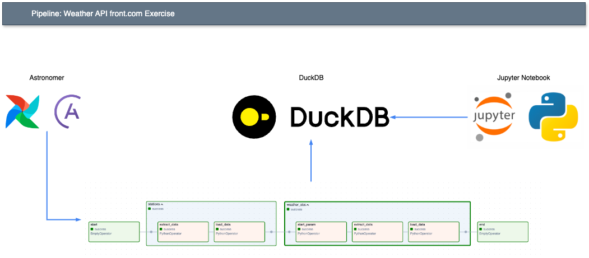

# front
Repository that contain a simple ETL pipeline.

## Getting Started 🔨

### Diagram


There are 3 principal components used in this pipeline:
* Astronomer
* DuckDB
* Jupyter Notebook

#### Astronomer
`Astronomer` is a managed `Airflow` Service, it provide us with astro CLI.

Please install it through homebrew using:
* `brew install astro`

In this case is used because it is an easy way to setup `Airflow`. `Airflow` was my preferred choice for the pipeline due to its compatibility with the job description and my prior experience.

#### DuckDB
`DuckDB` it is an in-memory OLAP SQL database.

I chose `DuckDB` because of its simplicity and the chance to gain hands-on experience with a new technology.

#### Jupyter Notebook
`Jupyter Notebook` is a web-based interactive computing platform.

I selected this for an easy interaction with the database `DuckDB`.

### Python
You need to have Python intalled. If you don't have Python installed, I would recomment to install `Python 3.11.3`. Which is the same version that I used for this pipeline.

You could install it using homebrew or another alternative. I tipically prefer `pyenv` to have multiples and isolated python environments.

This is a guide to use pyenv:

Please first create a sane environment https://github.com/pyenv/pyenv/wiki#suggested-build-environment. Run the following commands:
- `xcode-select --install`
- `brew install openssl readline sqlite3 xz zlib tcl-tk`

And then install pyenv and virtualenv:
- `brew install pyenv`
- `brew install pyenv-virtualenv`

Add the following lines to your ~/.zshrc file:

```
# Pyenv
export PYENV_ROOT="$HOME/.pyenv"
export PATH="$PYENV_ROOT/bin:$PATH"
eval "$(pyenv init --path)"
eval "$(pyenv init -)"
```

- Restart your terminal to apply the changes or run source command:
	- source ~/.zshrc
- Install the version of python that you need with:
	- pyenv install <python_version>
	- If you don't know which python version are available please run:
		- pyenv install --list
- Create a virtualenv for that python version
	- pyenv virtualenv <python_version> <environment_name>
- Create a .python-version file in the root of your folder where you want to use that python version and add the following line
	- <environment_name>
- Finally you are done, please run python --version and confirm that you are using the version that you want.

### Requirements
Install requirements with:
* `pip install -r requirements.txt`

## Usage ⚡
The first step to run the pipeline is to have astro CLI installed. Please run:

- `brew install astro`

Then run:
- `astro dev start`

You should be able to see this message on the console: `Airflow is starting up!`.

That will sent you to the Airflow UI after some minutes. On that step please go to `Admin` -> `Variables` -> `Import Variables`. Choose the file `airflow_vars.json` to load the variables which is only one: `weather_obs_last_date`.

By default that will be empty, that is how we will do the first part which is for the first time process last 7 days. Also it will works for us to know what was the last observation date that we ingest to the table. So consequent runs will only ingest new data.

Install Python with Jupyter Notebook support (I am using `Visual Studio Code` if you are using another IDE you should also have an option to interact with `.ipynb` files when install the required dependencies.).

Install the requirements with:
- `pip install - requirements.txt`

Go to the file `database.ipynb` and run every section before Analytic part.

Then you will have the database ready to ingest data. Now you can go to the Airflow instance and trigger the DAG.

For the first time will ingest the last 7 days, and consequent runs will ingest only new data.

Finally run the Analytic part in the file `database.ipynb` to retrieve the result of the two quieres asked in the exercise.

### Test
To run the tests please install pytest:
* `pip install pytest`

Then run the tests with:
* `python -m pytest`

### Coverage
To get coverage report please install coverage:
* `pip install coverage`

Then run coverage:
* `coverage run -m pytest`

Finally get the coverage report:
* `coverage report`
